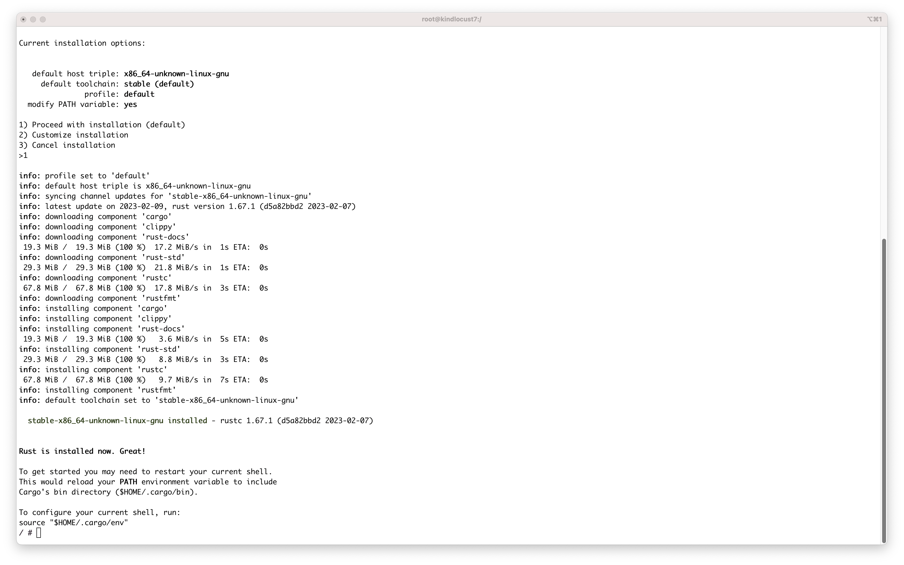

# Concordium Hackathon Task 1
### 1: Install Rust

### 2: Install cargo-concordium

### 3: Install Concordium-client

## 4: Create a Testnet account and acquiring testnet CCD via the CCD faucet

## 5: Export the account from web wallet and import it into Concordium client

## Mainnet
3JiFDTNs4znYq8gWkQzCxPxQCCb3bUGFuybfqv3ZC8CRpnE66R
